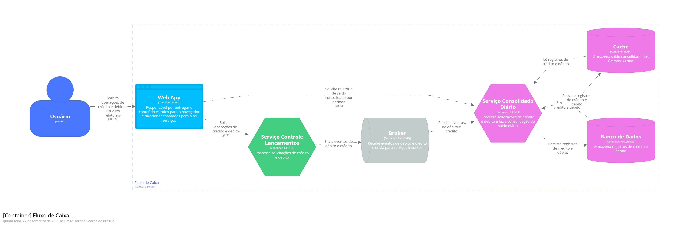
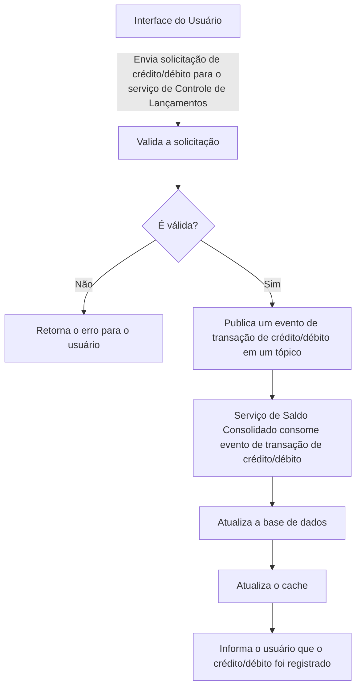
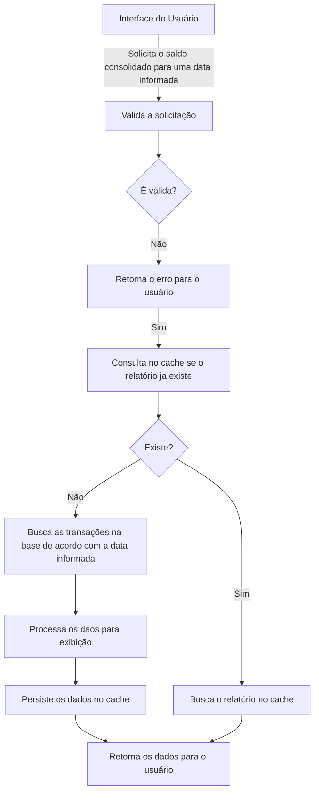

# 📄 Descrição do desafio:**

- [desafio-arquiteto-software-fev25.pdf](attachment:b9fd44e1-de8c-4ac1-9f34-0bd18df5ab85:desafio-arquiteto-software-fev25.pdf)

# Rodando em ambiente local

## Requisitos

- .NET 9
- Docker

### Passo a passo

1 - Certifique-se de que o Docker esteja rodando em sua máquina.

2 - Na raíz do projeto execute o seguinte comando:

```bash
docker compose -f .\deploy\docker-compose.yaml -p desafio-arquiteto up -d --build
```

Esse comando irá fazer o build da aplicação e subir o container com a aplicação e recursos necessários.

3 - Ao iniciarmos a aplicação pela primeira vez o migrations para criação do banco de dados será executado. Para fazer
isso manualmente execute o seguinte comando:

```bash
ef database update --project src\FC.Consolidado.Infra\FC.Consolidado.Infra.csproj --startup-project src\FC.Consolidado.Api\FC.Consolidado.Api.csproj --context FC.Consolidado.Infra.Data.ConsolidadoDbContext --configuration Debug 20250303124502_Initial
```

Pronto! A aplicação está pronta para ser utilizada. Você pode acessar através das seguintes URLs:

- API Lançamentos: http://localhost:8080/swagger
- API Consolidado: http://localhost:8081/swagger

# 📋 Decisões Arquiteturais

## ✅ Arquitetura de Microsserviços

A Arquitetura de Microsserviços foi a escolhida e se justifica por diversos fatores, principalmente em relação a
resiliência e escalabilidade.

As outras opções apresentadas não atendem a todos os requisitos:

### **Monolito**

Apesar de serem mais simples de desenvolver não atende o requisito para escalar individualmente o serviço de **“controle
de lançamentos”**. Além disso, sistemas monolíticos podem se tornar difíceis de manter a medida que crescem.

### **SOA**

Pode ser uma opção viável, mas geralmente envolve uma maior complexidade no desenvolvimento e promover um acoplamento
maior entre os serviços, podendo dificultar a escalabilidade.

### **Serverless**

Possuem escalabilidade automática e reduz os custos, porém nos traz um acoplamento com provedores de nuvem. Nesse
sentido, eu optaria por usar Serverless em serviços mais genéricos, que não processem regras do core do negócio.

**A seguir, uma explicação de cada ponto que me levou a decidir pelo uso de microsserviços.**

## 👍 **Vantagens de usar Microsserviços**

### Resiliência

Promove a independência dos serviços garantindo a resiliência do sistema, pois em caso de falha de um deles o outro pode
continuar funcionando normalmente, assegurando a continuidade das operações. Essa característica é fundamental para
evitar que o serviço de “controle de lançamentos” seja interrompido, conforme requisitos não funcionais informados.

### Escalabilidade

O uso dessa arquitetura nos permite escalar serviços individualmente, lidando com o aumento de carga sem degradar o
desempenho geral do sistema.

### Flexibilidade

A arquitetura em questão nos oferece flexibilidade para adotar diferentes tecnologias, frameworks e protocolos de
comunicação para cada serviço. Isso nos permite fazer escolhas mais assertivas de acordo com a necessidade de cada
contexto.

### Segurança

É possível aplicar políticas de segurança específicas para cada serviço, protegendo dados contra possíveis ameaças.

## 👎 Desvantagens de usar Microsserviços

### **Complexidade**

Ao optarmos em usar uma arquitetura de microsserviços precisamos ter em mente que estamos adotando toda a complexidade
envolvida. Isso inclui o desafio de gerenciar vários serviços, implantar monitorar e manter tudo isso. Além disso, do
meu ponto de vista, um dos maiores desafios é gerenciarmos as transações que precisam de atomicidade, pensarmos em
operações de compensação, operações idempotentes, tudo isso requer um planejamento estratégico e tático bem feito.

### **Comunicação entre serviços**

Os serviços precisam se comunicar através de uma rede, o que pode introduzir latência e exigir mecanismos robustos para
lidar com tudo isso.

### Gestão de dados

Garantir a consistência dos dados em uma arquitetura como essa pode ser algo desafiador e muitas vezes envolve
estratégias bem elaboradas. Aqui precisamos pensar em consistência eventual, onde os dados podem não ser consistentes
imediatamente, mas se tornarão com o tempo.

### **Sobrecarga de implantação**

Embora a flexibilidade de implantação seja um benefício, isso também significa mais esforço e ferramentas necessárias
para gerenciar o processo de implantação de múltiplos serviços.

### **Sobrecarga operacional**

Requer registro abrangente, monitoramento e rastreamento para entender o estado e o desempenho do sistema como um todo.

# 🗺️ Diagrama de contexto do sistema


# 🗾 Diagrama de containers



# 🧭 Diagrama de fluxo

## Registro de transação

[//]: # (![structurizr-1-Containers.png]&#40;doc/fluxo-transacao.png&#41;)



## Consulta do saldo consolidado

[//]: # (![structurizr-1-Containers.png]&#40;doc/fluxo-saldo-consolidado.png&#41;)



# ⬆️ Implantação

## Kubernetes

Para implantar os serviços eu optaria por fazer em um cluster Kubernetes pelos motivos descritos abaixo:

### Escalabilidade

Permite que os serviços se ajustem automaticamente de acordo com a demanda aumentando e diminuindo recursos conforme a
necessidade.

O Horinzontal Pod Autoscaler (HPA) automatiza o processo de escalabilidade horizontal ajustando o número de réplicas dos
PODs se baseando em métricas pré-estabelecidas, como o uso de CPU e memória.

### Alta disponibilidade

Nós podemos configurar um número mínimo e máximo de réplicas de nossos PODs para rodarmos nossos containers e quando um
POD falhar o Kubernetes se encarrega de substitui-lo automaticamente, garantindo a alta disponibilidade dos nossos
serviços. Além disso o cluster se encarrega de distribuir o tráfego entre as instâncias dos serviços, diminuindo a
sobrecarga.

### Implantação simplificada

Se uma versão falhar podemos facilmente voltar para anterior. Além disso o Kubernetes facilita as implantações para
termos um tempo de inatividade mínimo. Ao definirmos os nossos probes de forma correta sempre que uma nova versão for
implantada o Kubernetes vai manter a versão anterior até que a nova esteja pronta para receber solicitações.

### Ingress

Porta de entrada para acesso externo aos containers. Entre outros eu optaria por fazer uso do Istio, um service mesh,
que nos oferece recursos avançados de segurança e balanceamento de carga.

- **Roteamento Avançado:**
    - O Istio permite roteamento de tráfego com base em diversas regras, como cabeçalhos HTTP, caminhos e nomes de host.
    - Isso possibilita um balanceamento de carga inteligente e otimizado.
- **Segurança TLS:**
    - O Istio facilita o gerenciamento de certificados TLS e a terminação SSL, garantindo comunicação segura.
- **Recursos de Segurança:**
    - O Istio oferece políticas de segurança para controlar o acesso entre serviços, reforçando a proteção.

Além disso eu optaria por integrar o Istio com o Active Directory para autenticação externa e autorização baseada em
políticas.

# 🔭Telemetria e Observabilidade

Se quisermos nos antecipar a possíveis problemas e entender como nossa aplicação está se comportando é essencial
desenvolvermos sistemas observáveis. A princípio eu utilizaria o Prometheus para gerar dados que eu pudesse observar com
o Grafana e entender como minha aplicação está se comportando.

Independente das ferramentas, eu padronizaria meus serviços com as SDKs do Open Telemetry para gerar tracing, métricas e
logs. Desta forma estaríamos agnóstico a uma plataforma específica de observabilidade podendo tomar essa decisão a
qualquer momento.

# 📜Modelo tático

Os dois serviços foram colocados em uma mesma solução do .NET para simplificar as coisas. Em uma situação real eu
optaria por separar os repositórios.

O projeto a pasta `BuildingBlocks` contém meus projetos que são blocos de construção e podem ser reaproveitados em
qualquer serviço:

- `FC.Core` : Fornece objetos e configurações que são parte do Core da aplicação.
- `FC.MessageBus` : É uma abstração para configuração do Masstransit para lidar com o gerenciamento de mensagens e
  comunicação com o broker, no caso, com o RabbitMQ.
- `FC.ServicesDefaults` : Este projeto centraliza as configurações que são comuns para os serviços, como configurações
  do Swagger, OpenTelemetry, Prometheus, HealthChecks e extensões úteis.

Na pasta `src` é onde estão os meus serviços:

- `FC.Lancamentos`: Responsável por receber as requisições de transações e publicar em um tópico.
- `FC.Consolidado` : Responsável por consumir os eventos de transações do broker, persistir na base de dados e no cache.

Na pasta `test` é onde estão os testes de unidade dos dois serviços.

# 🗨️ Considerações finais

As necessidades do negócio e objetivo da organização precisariam ser analisados com mais cuidado a fim de agregar valor
real ao cliente. Onde a organização pretende chegar com a implementação de uma nova solução de software? Qual é o tempo
de mercado que ela deseja atingir seus objetivos?

Em uma situação real é provável que uma abordagem tática mais simplista seria o caminho que eu seguiria. Talvez um
monolito modular construído com um fluxo de dependência que desacople o negócio de detalhes de implementação seria o
melhor caminho e a longo prazo poderíamos entender melhor como o negócio iria se expandir e tomarmos decisões mais
assertivas sobre a estratégia a ser utilizada. O ponto que gostaria de levantar aqui é que para desenhar uma solução
ideal seria necessário entender melhor a estratégia da organização para evitar engenharia excessiva e complexidade
desnecessária.